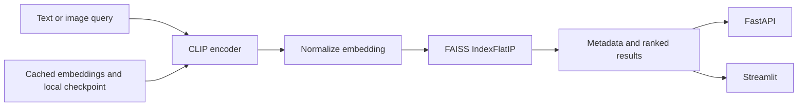
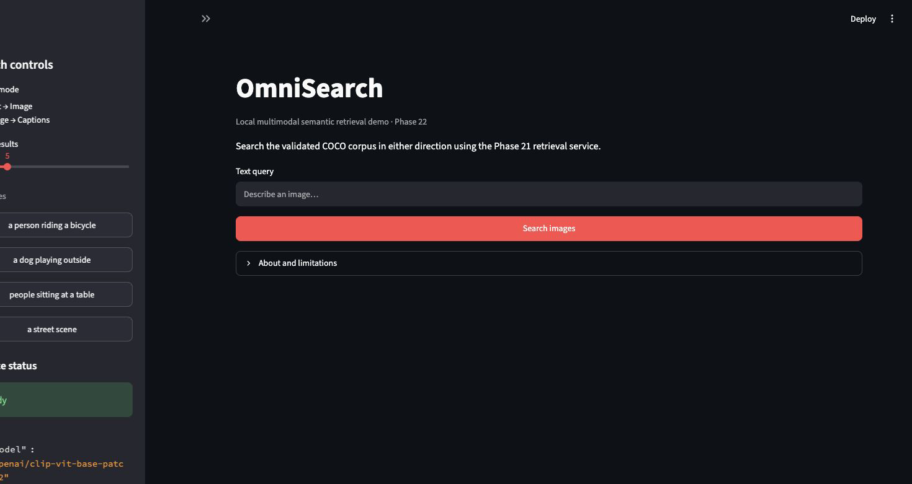
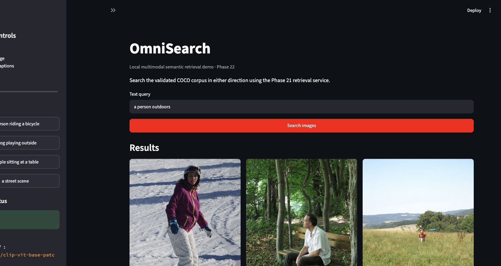
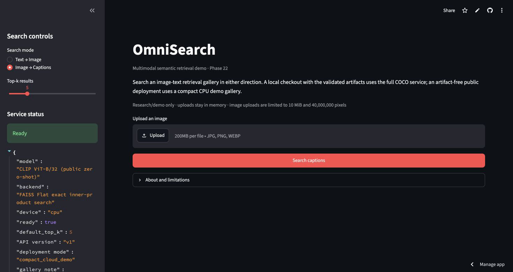

# OmniSearch

> A reproducible image-text retrieval system built around fine-tuned CLIP, exact FAISS search, and a local FastAPI/Streamlit demo.

[](https://github.com/Suyogkamath01/OmniSearch/actions/workflows/ci.yml)
[](https://www.python.org/)
[](https://streamlit.io/)
[](https://fastapi.tiangolo.com/)
[](https://pytorch.org/)
[](https://faiss.ai/)

OmniSearch maps images and captions into one shared embedding space and
supports text-to-image and image-to-caption retrieval. It is designed as a
serious technical portfolio project: the evaluation unit is explicit, splits
are image-grouped, the retrieval path is reusable, and the evidence boundary
is stated instead of hidden behind a polished demo.

## Why this project stands out

- **Leakage-aware evaluation:** every caption belonging to an image stays in
  the same train, validation, or test split.
- **Measured model decisions:** classical retrieval, frozen CLIP, full
  fine-tuning, LoRA, hard negatives, reranking, robustness, and calibration
  were compared before the serving configuration was selected.
- **One retrieval path:** FastAPI and Streamlit use the same
  `RetrievalService`, cached embeddings, and exact `IndexFlatIP` search.
- **Reproducible operations:** manifests, artifact metadata, preflight checks,
  device fallback, request IDs, bounded uploads, CI, and deployment checks are
  part of the repository.
- **Honest scope:** the full local demo depends on uncommitted model/data
  artifacts, CIRCO remains storage-deferred, and this is not presented as a
  public-production service.

## Architecture



The final serving configuration is full fine-tuned CLIP with 512-dimensional
normalized embeddings and exact inner-product search. A learned reranker was
tested but reduced held-out quality, so the simpler first-stage retriever is
the selected path.

## Technology

Python 3.12 · uv · PyTorch · Transformers · CLIP · FAISS · NumPy · Pillow ·
FastAPI · Streamlit · Pydantic · pytest · Ruff · mypy · GitHub Actions · Docker

## Headline results

These are the canonical held-out COCO `val2017` measurements retained from
the final validation. Image-to-text has multiple relevant captions per image,
so its R@1 is not ordinary single-label caption accuracy.

| Direction | R@1 | R@5 | R@10 | MRR |
| --- | ---: | ---: | ---: | ---: |
| Text → image | 0.8263 | 0.9880 | 1.0000 | 0.8946 |
| Image → text | 0.1837 | 0.8143 | 0.9303 | 0.9517 |

Measured on the validated native macOS MPS setup:

- cold start to `/ready`: **11.139 s**
- warm text-to-image latency: **12.31/11.62/15.46 ms**
  (mean/median/p95)
- warm image-to-text latency: **27.50/24.48/37.00 ms**
  (mean/median/p95)

These are local measurements, not production SLOs.

## Quick start

### Requirements

- Python 3.12
- [uv](https://docs.astral.sh/uv/)
- Local model/checkpoint, embeddings, indexes, metadata, and COCO resources
  for the full demo
- Apple MPS where available, with CPU fallback

### Install the public project

```bash
uv sync --frozen --extra test
```

For the API and Streamlit dependencies:

```bash
uv sync --frozen --extra deployment
cp .env.example .env
```

The `.env` file is local-only and is ignored by Git. Edit it only if your
checkpoint, cache, indexes, metadata, or ports differ from the documented
defaults.

### Run the local preflight

```bash
KMP_DUPLICATE_LIB_OK=TRUE \
HF_HUB_OFFLINE=1 TRANSFORMERS_OFFLINE=1 \
uv run omnisearch-preflight
```

The offline flags are appropriate after the Hugging Face model is cached
locally. For first-time setup, omit them until the model resources exist.

### Run FastAPI

```bash
KMP_DUPLICATE_LIB_OK=TRUE \
HF_HUB_OFFLINE=1 TRANSFORMERS_OFFLINE=1 \
uv run omnisearch-api
```

Then check:

```bash
curl http://127.0.0.1:8000/health
curl http://127.0.0.1:8000/ready
```

The API exposes health/readiness, text-to-image, and image-to-text routes
around the shared retrieval service.

### Run the Streamlit demo

Live demo: https://omnisearch-t75fwaqtmpbu8yrtoqqysi.streamlit.app/

Streamlit runs the service in-process and does not require FastAPI to be
running separately:

```bash
KMP_DUPLICATE_LIB_OK=TRUE \
HF_HUB_OFFLINE=1 TRANSFORMERS_OFFLINE=1 \
uv run omnisearch-ui
```

## Live demo screenshots

These captures were refreshed from the public Streamlit deployment. The
artifact-free cloud path uses a compact CPU gallery of public COCO validation
images; the full validated checkpoint and benchmark artifacts remain local-only.



*The landing view makes the public model label, CPU device, and ready state visible.*



*The text-to-image view shows real ranked bicycle images for a live query.*



*The reverse-retrieval view keeps the upload and caption-search path visible to a reviewer.*

## Research and benchmarks

The research record covers:

- dataset acquisition, schema validation, duplicate checks, and leakage
  protection
- classical baselines and frozen CLIP
- full fine-tuning, LoRA, hard negatives, and reranking
- exact-versus-approximate index comparisons
- seed stability, ablations, robustness, failure analysis, uncertainty,
  explainability, and responsible-AI limitations
- FastAPI, Streamlit, deployment, reliability, and end-to-end validation

The repository retains phase-specific entry points for reproducibility, but
they are not separate production services. The final user-facing path is the
shared service in `src/omnisearch/api/retrieval.py`, its FastAPI wrapper, and
the Streamlit adapter.

Status: **Phases 1–27 COMPLETE** for their declared scopes. Proper CIRCO
evaluation is **PARTIAL / NON-BLOCKING / STORAGE-DEFERRED** because its
official image gallery did not fit the available local storage. No CIRCO score
is claimed.

## Quality gates

The lightweight public checkout can run:

```bash
KMP_DUPLICATE_LIB_OK=TRUE uv run pytest
uv run ruff check src tests
uv run mypy src
uv run python -m compileall -q src tests
uv lock --check
```

The default suite uses fixtures and does not download datasets or model
weights. Artifact-dependent audits and the real-model smoke are marked
`local_data`/`real_model` and require the local runtime resources.

## Repository map

```text
src/omnisearch/       retrieval, data lifecycle, evaluation, API, UI, and phase runners
tests/                fixture, service, artifact, and optional real-model coverage
configs/              reproducible configuration defaults
docs/                 methodology, system, limitations, release, and file guide
artifacts/            small public evidence; large local resources stay ignored
.github/workflows/    clean-checkout CI
```

For personalised captions for the public files, see
[`docs/repository_guide.md`](docs/repository_guide.md). It explains what each
public module, document, test, and selected evidence file contributes.

## Security and honest limitations

Never commit `.env`, credentials, datasets, model weights, generated
embeddings, FAISS binaries, or private runtime logs. The public repository
contains configuration templates and small evidence records; the complete
demo requires obtaining the stated resources locally.

The local API/UI are research/demo interfaces, not public production
infrastructure. Public deployment would still require authentication, rate
limiting, TLS/reverse-proxy controls, upload abuse limits, content-safety
handling, monitoring, and operational data governance. Docker is an optional
portability path; native macOS MPS is the measured local path, and ordinary
Docker should be treated as CPU-only unless another accelerator is explicitly
validated.

The project does not claim fairness, multilingual quality, causal
explanations, million-scale retrieval, or a CIRCO score. Dataset and model
usage notes are in [`docs/dataset_card.md`](docs/dataset_card.md), while the
broader limitations are in [`docs/limitations.md`](docs/limitations.md) and
[`docs/system_card.md`](docs/system_card.md).

## Documentation

- [`docs/architecture.md`](docs/architecture.md) — system boundaries and data flow
- [`docs/evaluation.md`](docs/evaluation.md) — retrieval metrics and relevance rules
- [`docs/reproducibility.md`](docs/reproducibility.md) — environments, artifacts, and repeatable commands
- [`docs/experiments.md`](docs/experiments.md) — experiment results and negative findings
- [`docs/technical_defense.md`](docs/technical_defense.md) — design rationale and limitations
- [`docs/compute_audit.md`](docs/compute_audit.md) — hardware and resource context
- [`docs/repository_guide.md`](docs/repository_guide.md) — personalised captions for the public files and evidence

## License and usage notes

No source `LICENSE` file is currently included in this repository. Dataset,
image, annotation, and model usage must follow their own terms. COCO
annotations and website terms, image-rights limitations, and the project’s
non-redistribution boundary are documented in
[`docs/dataset_card.md`](docs/dataset_card.md).
